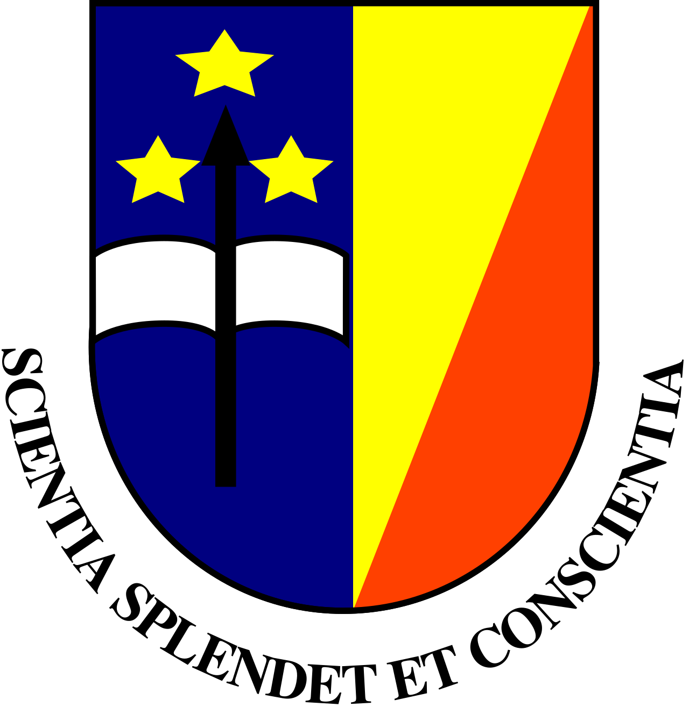

<p align="center">
  
</p>

# prog_python

Prog_Python — Système IoT de contrôle vocal pour moteur (Travail de Fin de Cycle)

Résumé
------
Ce dépôt contient le code, les notebooks et les documents associés au projet de fin de cycle portant sur la conception et l'évaluation d'un système IoT de contrôle vocal pour moteur. Le README a été aligné sur l'état réel du dépôt : il liste les fichiers et dossiers présents, indique comment reproduire les parties actives, et donne des exemples d'utilisation pratiques.

Contenu et architecture (état actuel)
------------------------------------
- pretraitement/
  - `extraction_mfcc.py` — outils d'extraction de MFCC et prétraitement audio
- c_model/
  - `CNN1_quantifie.cc` — code C/C++ généré du modèle quantifié (TinyML)
- models/
  - `models_non_quantifies/` et `models_quantifies/` — emplacements destinés aux modèles
- lt_spice/
  - simulations et documentation pour le circuit (fichiers `.asc`, `.asy`, PDF)
- rapports/figures/
  - images et figures utilisées dans le rapport (`unikin_logo.PNG`, etc.)
- Schéma_Kicad/, simul_ide/, test_circuit_commande/ — dossiers liés au matériel et aux simulations
- `tfc_train_model_Bosolindo.ipynb` — notebook principal d'entraînement / expérimentation
- `verification_model.py` — script utilitaire pour évaluer des modèles TFLite
- `requirements.txt` — dépendances Python

Remarque importante :
- Les références à des chemins/fichiers inexistants (ex. `src/`, `firmware/`, `tests/`, et certains scripts cités dans l'ancienne version du README) ont été retirées pour éviter toute confusion. Si vous avez une copie de ces fichiers à réintégrer, dites‑le et je mettrai le README à jour.

Comment reproduire (rapide)
---------------------------
1. Cloner le dépôt :

```bash
git clone https://github.com/robohie/prog_python.git
cd prog_python
```

2. Créer un environnement virtuel et installer les dépendances :

```bash
python -m venv .venv
# Linux / macOS
source .venv/bin/activate
# Windows
.venv\Scripts\activate
pip install -r requirements.txt
```

3. Ouvrir et exécuter les notebooks :
- Lancer Jupyter / JupyterLab et ouvrir `tfc_train_model_Bosolindo.ipynb` pour reproduire l'entraînement et l'analyse.

4. Script d'évaluation / vérification :
- `verification_model.py` fournit deux fonctions (pour modèles non quantifiés et quantifiés). Voir la section suivante pour un exemple d'utilisation et les attentes sur le format des données.

Utilisation détaillée de verification_model.py
---------------------------------------------
Le script `verification_model.py` expose actuellement deux fonctions : `verification1(model_path, x_test, y_test)` pour modèles non quantifiés et `verification2(model_q_path, x_test, y_test)` pour modèles quantifiés.

Formats attendus
- x_test : numpy array de formes `(N, ...)` correspondant à la forme d'entrée du modèle. Les valeurs doivent être float32 pour les modèles non quantifiés.
- y_test : labels correspondants. Le code actuel compare `argmax` des sorties et des étiquettes — cela signifie que `y_test` doit être au format one-hot (vecteurs de probabilités/0-1) ou transformable en argmax. Si vous avez des indices de classes entières (0..C-1), convertissez avec `tf.keras.utils.to_categorical(y_indices, num_classes)`.

Exemple d'usage (depuis un notebook ou script) :

```python
import numpy as np
from verification_model import verification1, verification2

# charger/définir vos données de test
x_test = np.load('data/x_test.npy')            # shape (N, ...) dtype float32
y_test = np.load('data/y_test_onehot.npy')    # shape (N, num_classes)

# évaluer un modèle tflite non quantifié
model_path = 'models/models_non_quantifies/my_model.tflite'
acc = verification1(model_path, x_test, y_test)
print(f'Accuracy (float model): {acc:.2%}')

# évaluer un modèle tflite quantifié
model_q_path = 'models/models_quantifies/my_model_quant.tflite'
acc_q = verification2(model_q_path, x_test, y_test)
print(f'Accuracy (quantized model): {acc_q:.2%}')
```
Licence et contact
------------------
- Licence : ajoutez le fichier `LICENSE` si vous souhaitez une licence explicite (ex. MIT).
- Mainteneur : robohie — https://github.com/robohie
- Courriel : rogerbosolinndo34@gmail.com

---

Si vous validez, j'appliquerai maintenant :
- soit (A) aucune modification supplémentaire, ou
- soit (B) le patch automatique recommandé pour `verification_model.py`, ou
- soit (C) créer une branche et ouvrir une PR contenant le README affiné + le patch proposé pour `verification_model.py`.
